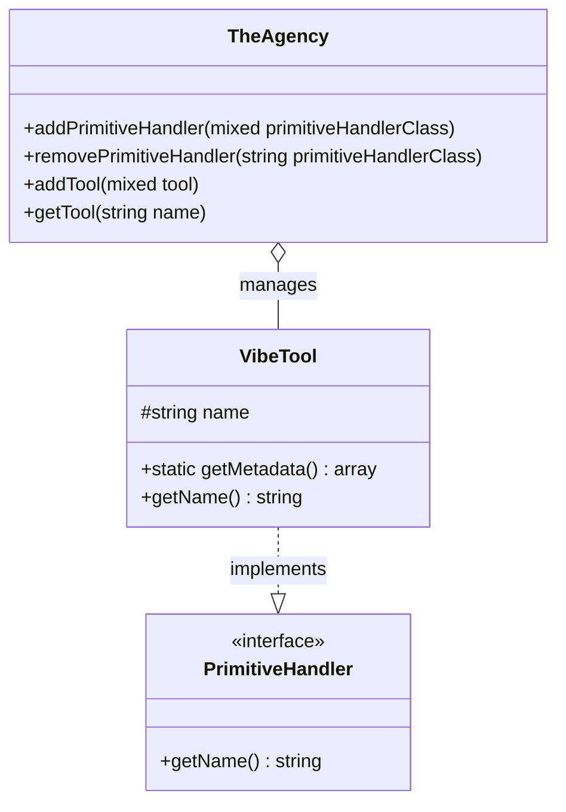

# 🤖 Laravel Vibes

[](https://www.php.net/)
[](https://laravel.com/)
[](LICENSE.md)
[](https://github.com/projectsaturnstudios/laravel-vibes)

A powerful Laravel package for implementing the Machine Control Protocol (MCP) server, enabling seamless integration with AI agents in your applications. Build intelligent, interactive features with structured tool definitions and real-time communication.

<details>
<summary>📖 Table of Contents</summary>

- [🤖 Laravel Vibes](#-laravel-vibes)
  - [✨ Key Features](#-key-features)
  - [🚦 Implementation Status](#-implementation-status)
    - [Primitive Implementation Status](#primitive-implementation-status)
    - [Feature Availability Matrix](#feature-availability-matrix)
  - [📚 Documentation](#-documentation)
    - [Class Diagram](#class-diagram)
  - [🔧 Installation](#-installation)
  - [⚙️ Configuration](#️-configuration)
  - [🚀 Usage](#-usage)
    - [Registering Tools](#registering-tools)
    - [Defining a Custom Tool](#defining-a-custom-tool)
    - [Using Server-Sent Events](#using-server-sent-events)
    - [Handling AI Agent Messages](#handling-ai-agent-messages)
  - [🔍 Tool Discovery & Registration](#-tool-discovery--registration)
    - [Auto-Discovery](#auto-discovery)
    - [Manual Registration](#manual-registration)
    - [Caching Primitives](#caching-primitives)
  - [🧪 Comprehensive Testing Guide](#-comprehensive-testing-guide)
    - [Unit Testing Custom Tools](#unit-testing-custom-tools)
    - [Mocking External Services](#mocking-external-services)
    - [Integration Testing with TheAgency](#integration-testing-with-theagency)
    - [Testing SSE Connections](#testing-sse-connections)
    - [Mocking AI Agent Interactions](#mocking-ai-agent-interactions)
    - [PHPUnit Configuration Recommendations](#phpunit-configuration-recommendations)
    - [Testing Best Practices](#testing-best-practices)
  - [🧰 API Reference](#-api-reference)
    - [TheAgency Class](#theagency-class)
    - [VibeTool Class](#vibetool-class)
    - [PrimitiveHandler Interface](#primitivehandler-interface)
    - [Common Usage Patterns](#common-usage-patterns)
  - [🛡️ Middleware Components](#-middleware-components)
    - [mcp-agent Middleware Group](#mcp-agent-middleware-group)
    - [ScaffoldSSEConnection Middleware](#scaffoldssconnection-middleware)
    - [ValidAgentCorsHeaders Middleware](#validagentcorsheaders-middleware)
    - [Security Best Practices](#security-best-practices)
    - [Complete Middleware Stack Example](#complete-middleware-stack-example)
  - [🤝 MCP Protocol Integration](#-mcp-protocol-integration)
    - [What is the MCP Protocol?](#what-is-the-mcp-protocol)
    - [MCP Message Structure](#mcp-message-structure)
    - [Laravel Vibes MCP Implementation](#laravel-vibes-mcp-implementation)
    - [Supported MCP Methods](#supported-mcp-methods)
    - [Communication Flow](#communication-flow)
    - [Future Protocol Support](#future-protocol-support)
    - [Official Documentation](#official-documentation)
  - [🚀 Advanced Usage Examples](#-advanced-usage-examples)
    - [Error Handling Patterns](#error-handling-patterns)
    - [Anthropic Claude Integration](#anthropic-claude-integration)
    - [Event-driven MCP Architecture](#event-driven-mcp-architecture)
    - [Database-backed Tool Implementation](#database-backed-tool-implementation)
    - [Complex Multi-step Agent Interaction](#complex-multi-step-agent-interaction)
    - [Custom Validation for Tool Parameters](#custom-validation-for-tool-parameters)
  - [🔄 Laravel 12 Compatibility](#-laravel-12-compatibility)
    - [Version Compatibility Matrix](#version-compatibility-matrix)
    - [Laravel 12 Features Utilized](#laravel-12-features-utilized)
    - [Upgrading from Previous Laravel Versions](#upgrading-from-previous-laravel-versions)
    - [Known Issues & Limitations](#known-issues--limitations)
    - [Composer Requirements](#composer-requirements)
  - [🚀 Deployment Considerations](#-deployment-considerations)
    - [Production Environment Configuration](#production-environment-configuration)
    - [Performance Optimization](#performance-optimization)
    - [Scaling Strategies](#scaling-strategies)
    - [Monitoring and Logging](#monitoring-and-logging)
    - [Resource Management](#resource-management)
    - [Security in Production](#security-in-production)
    - [Hosting Platform-Specific Guidelines](#hosting-platform-specific-guidelines)
  - [📊 Architecture](#-architecture)
  - [📅 Roadmap](#-roadmap)
  - [👥 Credits](#-credits)
  - [🔒 Security](#-security)
  - [📄 License](#-license)
  - [🤝 Contributing](#-contributing)
  - [🔄 Flow Diagrams](#-flow-diagrams)
  - [🌟 Real-World Examples](#-real-world-examples)

</details>

## ✨ Key Features

- 🔧 **Tool Registration System** - Define, register, and expose tools for AI agents to use
- 🔄 **Server-Sent Events (SSE)** - Real-time communication with AI agents via event streams
- 🛣️ **API Endpoints** - Ready-to-use endpoints for MCP protocol implementation
- 🧩 **Primitive Handlers** - Extensible system for various MCP primitives
- 🔍 **Auto-Discovery** - Automatic discovery of tool implementations in your codebase
- 🦺 **Type Safety** - Full PHP 8.2+ type hinting and return type declarations
- 🔮 **Future-Ready** - Foundation for upcoming MCP features (resources, prompts, samples, and roots) with framework in place

## 🚦 Implementation Status

This section provides a clear overview of which MCP primitives are currently implemented and which are planned for future releases.

### Primitive Implementation Status

| Primitive | Status | Version Introduced | Notes |
|-----------|--------|-------------------|-------|
| Tools | ✅ Full | 0.1.0 | Complete implementation with repositories, data objects, and discovery |
| Resources | 🚧 Partial | 0.4.0 | Framework in place, API not finalized |
| Prompts | 🚧 Partial | 0.4.0 | Framework in place, API not finalized |
| Samples | 🚧 Partial | 0.4.0 | Framework in place, API not finalized |
| Roots | 🚧 Partial | 0.4.0 | Framework in place, API not finalized |

### Feature Availability Matrix

| Feature | v0.1.0 | v0.2.0 | v0.3.0 | v0.4.0 | Planned |
|---------|--------|--------|--------|--------|---------|
| Tool Registration | ✅ | ✅ | ✅ | ✅ | ✅ |
| Server-Sent Events | ✅ | ✅ | ✅ | ✅ | ✅ |
| Auto-Discovery | ❌ | ✅ | ✅ | ✅ | ✅ |
| Primitive Caching | ❌ | ❌ | ✅ | ✅ | ✅ |
| Resource Primitives | ❌ | ❌ | ❌ | 🚧 | ✅ |
| Prompt Primitives | ❌ | ❌ | ❌ | 🚧 | ✅ |
| Sample Primitives | ❌ | ❌ | ❌ | 🚧 | ✅ |
| Root Primitives | ❌ | ❌ | ❌ | 🚧 | ✅ |

Legend:
- ✅ Full implementation
- 🚧 Partial implementation
- ❌ Not implemented

## 📚 Documentation

Comprehensive documentation for Laravel Vibes is available in the `docs/` directory:

| Documentation File | Description |
|-------------------|-------------|
| [TheAgency.md](docs/TheAgency.md) | Detailed documentation for TheAgency class, the central orchestrator for MCP primitives |
| [ClassDiagram.md](docs/ClassDiagram.md) | Structural diagram showing relationships between classes |
| [UsageExamples.md](docs/UsageExamples.md) | Practical examples for using Laravel Vibes in your applications |
| [CONTRIBUTING.md](docs/CONTRIBUTING.md) | Guidelines for contributing to Laravel Vibes |
| [Flow-Diagrams.md](docs/Flow-Diagrams.md) | Visual diagrams of Laravel Vibes architecture and workflows |
| [Examples.md](docs/Examples.md) | Real-world examples of Laravel Vibes implementation |
| [index.md](docs/index.md) | Overview and core concepts documentation |

### Class Diagram

Below is a simplified class diagram showing the main components of Laravel Vibes:



## 🔧 Installation

You can install the package via composer:

```bash
composer require projectsaturnstudios/laravel-vibes
```

The package will automatically register its service provider with Laravel.

## ⚙️ Configuration

Publish the configuration files with:

```bash
php artisan vendor:publish --tag="vibes"
```

This will publish the configuration file to `config/vibes.php` and `config/cors.vibes.php`.

Key configuration options:

```php
return [
    'service_info' => [
        'server_name' => env('VIBE_SVC_NAME', 'laravel-vibes-server'),
        'server_version' => env('VIBE_SVC_VERSION', '1.0.0'),
        'heartbeat_interval' => 20, // seconds
        'catch_exceptions' => false, // Catch exceptions in MCP event loop
    ],
    
    'features' => [
        'tools' => true,      // Tool registration and execution (fully implemented)
        'resources' => false, // Resource discovery and access (partial implementation)
        'prompts' => false,   // Prompt templates and execution (partial implementation)
        'samples' => false,   // Model behavior configuration (partial implementation)
        'roots' => false,     // Custom workflow entry points (partial implementation)
    ],
    
    'auto_discover_all_primitives' => [app()->path()],
    'auto_discover_base_path' => base_path(),
    
    // Tool repository and route configurations...
];
```

**👉 Learn more:** For advanced configuration options, see the [Configuration section in TheAgency.md](docs/TheAgency.md#configuration).

## 🚀 Usage

### Registering Tools

Register AI tools in your service provider:

```php
use App\Tools\TextAnalysisTool;
use App\Tools\DataFetchTool;

// In a service provider's boot method
public function boot()
{
    $agency = app('the-agency');
    
    $agency->addTools([
        TextAnalysisTool::class,
        DataFetchTool::class,
    ]);
}
```

Or register via the config file:

```php
'tools' => [
    'text-analysis' => \App\Tools\TextAnalysisTool::class,
    'data-fetch' => \App\Tools\DataFetchTool::class,
],
```

### Defining a Custom Tool

Create a tool that AI agents can use:

```php
<?php

namespace App\Tools;

use ProjectSaturnStudios\Vibes\Primitives\Tools\Data\VibeTool;

class WeatherTool extends VibeTool
{
    protected string $name = 'weather';

    public static function getMetadata(): array
    {
        return [
            'name' => 'weather',
            'description' => 'Get current weather for a location',
            'parameters' => [
                'type' => 'object',
                'properties' => [
                    'location' => [
                        'type' => 'string',
                        'description' => 'City name or location'
                    ]
                ],
                'required' => ['location']
            ]
        ];
    }
    
    public function handle(string $location)
    {
        // Implement weather lookup logic
        return [
            'location' => $location,
            'temperature' => 72,
            'conditions' => 'sunny'
        ];
    }
}
```

### Using Server-Sent Events

Connect AI agents to your application using SSE:

```php
// Frontend JavaScript
const eventSource = new EventSource('/mcp/sse');
const sessionId = generateUniqueId();

eventSource.onmessage = (event) => {
    const data = JSON.parse(event.data);
    console.log('Received update:', data);
};
```

### Handling AI Agent Messages

Process incoming MCP messages from agents:

```php
// POST to /mcp/sse/messages
{
    "jsonrpc": "2.0",
    "method": "run_tool",
    "session_id": "session-12345",
    "id": "req-1",
    "params": {
        "name": "weather",
        "input": {
            "location": "San Francisco"
        }
    }
}
```

**👉 Learn more:** Detailed usage examples are available in the [UsageExamples.md](docs/UsageExamples.md) documentation.

## 🔍 Tool Discovery & Registration

Laravel Vibes follows a similar approach to Laravel Event Sourcing for loading primitives, using automatic discovery and registration patterns. For more detailed examples, see the [UsageExamples.md](docs/UsageExamples.md) documentation.

### Auto-Discovery

The package automatically discovers and registers tools and other MCP primitives in the configured directories:

```php
// config/vibes.php
'auto_discover_all_primitives' => [app()->path()], // Directories to scan for primitives
'auto_discover_base_path' => base_path(), // Base path for relative directories
```

During application bootstrapping, Laravel Vibes scans these directories for classes that implement the `PrimitiveHandler` interface and automatically registers them with TheAgency:

```php
protected function discoverPrimitiveHandlers() :  void
{
    $agency = app(TheAgency::class);

    $cachedPrimitiveHandlers = $this->getCachedPrimitiveHandlers();

    if (! is_null($cachedPrimitiveHandlers)) {
        $agency->addPrimitiveHandlers($cachedPrimitiveHandlers);
        return;
    }

    (new PrimitiveHandlerDiscoveryService)
        ->within(config('vibes.auto_discover_all_primitives'))
        ->useBasePath(config('vibes.auto_discover_base_path', base_path()))
        ->ignoringFiles(Composer::getAutoloadedFiles(base_path('composer.json')))
        ->addToTheAgency($agency);
}
```

### Manual Registration

For manual registration, modify your `AppServiceProvider` or create a dedicated service provider:

```php
<?php

namespace App\Providers;

use Illuminate\Support\ServiceProvider;
use ProjectSaturnStudios\Vibes\TheAgency;
use App\MCP\Tools\WeatherTool;
use App\MCP\Tools\TranslationTool;
use App\MCP\Resources\UserResource;
use App\MCP\Prompts\GreetingPrompt;

class MCPServiceProvider extends ServiceProvider
{
    public function boot()
    {
        // Get the agency singleton
        $agency = app(TheAgency::class);
        
        // Register tools
        $agency->addTools([
            WeatherTool::class,
            TranslationTool::class,
        ]);
        
        // Register other primitives when implemented
        // $agency->addResources([
        //    UserResource::class,
        // ]);
        
        // $agency->addPrompts([
        //    GreetingPrompt::class,
        // ]);
    }
}
```

Then add your provider to `config/app.php`:

```php
'providers' => [
    // Other service providers...
    App\Providers\MCPServiceProvider::class,
],
```

### Caching Primitives

For production environments, Laravel Vibes provides caching mechanisms to improve performance. The discovered primitives are cached at `bootstrap/cache/vibes.php`. 

To clear the cache during development:

```bash
php artisan cache:clear
```

You can also implement a dedicated command to manage the primitive cache (similar to Laravel Event Sourcing's `event-sourcing:cache-event-handlers`):

```php
// Register the command in your service provider
$this->app->booted(function () {
    $this->app['events']->listen('cache:clearing', function () {
        // Clear cached primitives
        @unlink($this->app['config']['vibes.service_info.cache_path'].'/vibes.php');
    });
});
```

## 🧪 Comprehensive Testing Guide

This section provides guidance and examples for testing Laravel Vibes components, focusing on custom tools and AI agent interactions.

### Unit Testing Custom Tools

Test your custom tools to ensure they properly handle inputs and produce expected outputs:

```php
<?php

namespace Tests\Unit\Tools;

use Tests\TestCase;
use App\Tools\WeatherTool;
use ProjectSaturnStudios\Vibes\TheAgency;
use ProjectSaturnStudios\Vibes\Exceptions\InvalidToolParameters;

class WeatherToolTest extends TestCase
{
    protected TheAgency $agency;
    protected WeatherTool $weatherTool;
    
    protected function setUp(): void
    {
        parent::setUp();
        
        $this->agency = app(TheAgency::class);
        $this->weatherTool = new WeatherTool();
        
        // Register the tool with TheAgency
        $this->agency->addTool($this->weatherTool);
    }
    
    /** @test */
    public function it_has_correct_metadata()
    {
        $metadata = WeatherTool::getMetadata();
        
        $this->assertEquals('weather', $metadata['name']);
        $this->assertArrayHasKey('description', $metadata);
        $this->assertArrayHasKey('parameters', $metadata);
        $this->assertArrayHasKey('properties', $metadata['parameters']);
        $this->assertArrayHasKey('location', $metadata['parameters']['properties']);
    }
    
    /** @test */
    public function it_handles_valid_location()
    {
        $result = $this->weatherTool->handle('San Francisco');
        
        $this->assertIsArray($result);
        $this->assertArrayHasKey('location', $result);
        $this->assertArrayHasKey('temperature', $result);
        $this->assertArrayHasKey('conditions', $result);
        $this->assertEquals('San Francisco', $result['location']);
    }
    
    /** @test */
    public function it_throws_exception_for_invalid_location()
    {
        $this->expectException(InvalidToolParameters::class);
        
        $this->weatherTool->handle('NonExistentLocation123456789');
    }
    
    /** @test */
    public function it_is_registered_with_the_agency()
    {
        $tool = $this->agency->getTool('weather');
        
        $this->assertNotNull($tool);
        $this->assertInstanceOf(WeatherTool::class, $tool);
    }
}
```

### Mocking External Services

Test tools that interact with external services by mocking the HTTP responses:

```php
<?php

namespace Tests\Unit\Tools;

use Tests\TestCase;
use App\Tools\ExternalApiTool;
use Illuminate\Support\Facades\Http;
use ProjectSaturnStudios\Vibes\Exceptions\ToolExecutionError;

class ExternalApiToolTest extends TestCase
{
    protected function setUp(): void
    {
        parent::setUp();
        
        // Mock external API responses
        Http::fake([
            'api.example.com/data*' => Http::response([
                'success' => true,
                'data' => [
                    'id' => 123,
                    'name' => 'Test Item',
                    'value' => 99.95
                ]
            ], 200),
            'api.example.com/error*' => Http::response([
                'success' => false,
                'error' => 'Resource not found'
            ], 404),
        ]);
    }
    
    /** @test */
    public function it_fetches_and_formats_external_data()
    {
        $tool = new ExternalApiTool();
        $result = $tool->handle('data', ['id' => 123]);
        
        $this->assertIsArray($result);
        $this->assertTrue($result['success']);
        $this->assertEquals('Test Item', $result['data']['name']);
        $this->assertEquals(99.95, $result['data']['value']);
    }
    
    /** @test */
    public function it_handles_api_errors_appropriately()
    {
        $this->expectException(ToolExecutionError::class);
        
        $tool = new ExternalApiTool();
        $tool->handle('error', ['id' => 999]);
    }
    
    /** @test */
    public function it_retries_on_temporary_failures()
    {
        Http::fake([
            // First call fails, second succeeds
            'api.example.com/flaky*' => Http::sequence()
                ->push(['error' => 'Server busy'], 503)
                ->push(['success' => true, 'data' => ['name' => 'Flaky Test']], 200),
        ]);
        
        $tool = new ExternalApiTool();
        $result = $tool->handle('flaky', ['id' => 456]);
        
        $this->assertTrue($result['success']);
        $this->assertEquals('Flaky Test', $result['data']['name']);
    }
}
```

### Integration Testing with TheAgency

Test the integration of tools with TheAgency:

```php
<?php

namespace Tests\Feature;

use Tests\TestCase;
use App\Tools\CalculatorTool;
use ProjectSaturnStudios\Vibes\TheAgency;
use ProjectSaturnStudios\Vibes\VibeSesh;

class AgencyToolIntegrationTest extends TestCase
{
    protected TheAgency $agency;
    
    protected function setUp(): void
    {
        parent::setUp();
        
        $this->agency = app(TheAgency::class);
        
        // Register test tools
        $this->agency->addTool(CalculatorTool::class);
    }
    
    /** @test */
    public function it_executes_calculator_tool_through_agency()
    {
        // Create a test session
        $session = new VibeSesh('test-session-123');
        
        // Prepare a tool execution request
        $request = [
            'jsonrpc' => '2.0',
            'method' => 'run_tool',
            'id' => 'req-'.time(),
            'session_id' => $session->getId(),
            'params' => [
                'name' => 'calculator',
                'input' => [
                    'operation' => 'add',
                    'a' => 5,
                    'b' => 7
                ]
            ]
        ];
        
        // Process through TheAgency
        $response = $this->agency->processRequest($request, $session);
        
        // Verify response
        $this->assertEquals('2.0', $response['jsonrpc']);
        $this->assertEquals($request['id'], $response['id']);
        $this->assertEquals(12, $response['result']['sum']);
    }
    
    /** @test */
    public function it_returns_proper_error_for_invalid_tool_name()
    {
        $session = new VibeSesh('test-session-123');
        
        $request = [
            'jsonrpc' => '2.0',
            'method' => 'run_tool',
            'id' => 'req-'.time(),
            'session_id' => $session->getId(),
            'params' => [
                'name' => 'non-existent-tool',
                'input' => []
            ]
        ];
        
        $response = $this->agency->processRequest($request, $session);
        
        $this->assertArrayHasKey('error', $response);
        $this->assertEquals(-32601, $response['error']['code']);
    }
}
```

### Testing SSE Connections

Test Server-Sent Events (SSE) connections using the following approach:

```php
<?php

namespace Tests\Feature;

use Tests\TestCase;
use Illuminate\Testing\TestResponse;
use Illuminate\Support\Facades\Event;
use App\Events\AgentConnected;

class SSEConnectionTest extends TestCase
{
    /** @test */
    public function it_establishes_sse_connection_successfully()
    {
        // Listen for connection events
        Event::fake([AgentConnected::class]);
        
        // Make request to SSE endpoint
        $response = $this->get('/mcp/sse', [
            'Accept' => 'text/event-stream',
            'Cache-Control' => 'no-cache',
            'X-Requested-With' => 'XMLHttpRequest',
        ]);
        
        // Check connection setup
        $response->assertStatus(200);
        $response->assertHeader('Content-Type', 'text/event-stream');
        $response->assertHeader('Cache-Control', 'no-cache, private');
        $response->assertHeader('Connection', 'keep-alive');
        
        // Confirm response has SSE format
        $this->assertStringContainsString('data:', $response->getContent());
        $this->assertStringContainsString('id:', $response->getContent());
        $this->assertStringContainsString('event: endpoint-info', $response->getContent());
        
        // Verify event was dispatched
        Event::assertDispatched(AgentConnected::class);
    }
    
    /** @test */
    public function it_includes_endpoint_information_in_sse_init()
    {
        $response = $this->get('/mcp/sse');
        
        // Extract the JSON data from the SSE response
        $matches = [];
        preg_match('/data: (.+)/', $response->getContent(), $matches);
        
        if (count($matches) > 1) {
            $data = json_decode($matches[1], true);
            
            $this->assertIsArray($data);
            $this->assertArrayHasKey('endpoints', $data);
            $this->assertArrayHasKey('message', $data['endpoints']);
            $this->assertEquals(route('vibes.messages'), $data['endpoints']['message']);
        } else {
            $this->fail('Could not extract SSE data from response');
        }
    }
}
```

### Mocking AI Agent Interactions

Test components that interact with AI agents:

```php
<?php

namespace Tests\Unit\Services;

use Tests\TestCase;
use App\Services\ClaudeService;
use Illuminate\Support\Facades\Http;
use ProjectSaturnStudios\Vibes\TheAgency;
use App\Tools\CalculatorTool;

class ClaudeServiceTest extends TestCase
{
    protected ClaudeService $service;
    
    protected function setUp(): void
    {
        parent::setUp();
        
        // Get TheAgency and register tools
        $agency = app(TheAgency::class);
        $agency->addTool(CalculatorTool::class);
        
        // Create service with mocked dependencies
        $this->service = app(ClaudeService::class);
        
        // Mock Claude API responses
        Http::fake([
            'https://api.anthropic.com/v1/messages' => Http::response([
                'id' => 'msg_01234567',
                'model' => 'claude-3-opus-20240229',
                'content' => [
                    ['type' => 'text', 'text' => 'This is a test response from Claude']
                ],
                'tool_calls' => [
                    [
                        'id' => 'call_01234567',
                        'name' => 'calculator',
                        'parameters' => [
                            'operation' => 'multiply',
                            'a' => 4,
                            'b' => 5
                        ]
                    ]
                ]
            ], 200),
        ]);
    }
    
    /** @test */
    public function it_sends_request_to_claude_api()
    {
        $response = $this->service->createMessage('Test prompt');
        
        $this->assertIsArray($response);
        $this->assertArrayHasKey('content', $response);
        $this->assertArrayHasKey('tool_calls', $response);
        $this->assertEquals('This is a test response from Claude', $response['content'][0]['text']);
    }
    
    /** @test */
    public function it_handles_tool_calls()
    {
        // Get a sample tool call from the API response
        $response = $this->service->createMessage('Test prompt');
        $toolCall = $response['tool_calls'][0];
        
        // Process the tool call
        $result = $this->service->handleToolCall($toolCall, 'test-convo-123');
        
        $this->assertIsArray($result);
        $this->assertEquals('success', $result['status']);
        $this->assertEquals(20, $result['result']['product']); // 4 * 5 = 20
    }
}
```

### PHPUnit Configuration Recommendations

Here's a sample PHPUnit configuration for optimal testing of Laravel Vibes components:

```xml
<?xml version="1.0" encoding="UTF-8"?>
<phpunit xmlns:xsi="http://www.w3.org/2001/XMLSchema-instance"
         xsi:noNamespaceSchemaLocation="./vendor/phpunit/phpunit/phpunit.xsd"
         bootstrap="vendor/autoload.php"
         colors="true">
    <testsuites>
        <testsuite name="Unit">
            <directory suffix="Test.php">./tests/Unit</directory>
        </testsuite>
        <testsuite name="Feature">
            <directory suffix="Test.php">./tests/Feature</directory>
        </testsuite>
        <testsuite name="Tools">
            <directory suffix="Test.php">./tests/Unit/Tools</directory>
        </testsuite>
        <testsuite name="Agent">
            <directory suffix="Test.php">./tests/Feature/Agent</directory>
        </testsuite>
    </testsuites>
    <coverage processUncoveredFiles="true">
        <include>
            <directory suffix=".php">./app</directory>
            <directory suffix=".php">./src</directory>
        </include>
    </coverage>
    <php>
        <env name="APP_ENV" value="testing"/>
        <env name="CACHE_DRIVER" value="array"/>
        <env name="SESSION_DRIVER" value="array"/>
        <env name="QUEUE_DRIVER" value="sync"/>
        <env name="DB_CONNECTION" value="sqlite"/>
        <env name="DB_DATABASE" value=":memory:"/>
        <env name="ANTHROPIC_API_KEY" value="test_api_key"/>
        <env name="VIBES_TOOLS_CACHE" value="false"/>
    </php>
</phpunit>
```

### Testing Best Practices

When testing Laravel Vibes components, follow these best practices:

1. **Isolate your tests**: Ensure each test is independent and can run in any order.
2. **Use test doubles**: Mock external dependencies like HTTP APIs, databases, and services.
3. **Test edge cases**: Verify behavior with invalid inputs, error conditions, and boundary values.
4. **Emulate real-world scenarios**: Create tests that mirror actual usage patterns.
5. **Test asynchronous behavior**: Verify SSE connections and event listeners work correctly.
6. **Use data providers**: Test tools with multiple input/output combinations.
7. **Check exception handling**: Verify tools throw appropriate exceptions for invalid inputs.
8. **Test middleware independently**: Isolate middleware functionality from controller logic.

For detailed example tests, check out the [tests directory](https://github.com/ProjectSaturnStudios/laravel-vibes/tree/main/tests) in the Laravel Vibes repository.

**👉 Learn more:** For more detailed testing examples and strategies, see the [Testing section in UsageExamples.md](docs/UsageExamples.md#testing).

## 🔄 Laravel 12 Compatibility

Laravel Vibes is designed to be fully compatible with Laravel 12.x, leveraging many of its new features and improvements to provide optimal performance and developer experience.

### Version Compatibility Matrix

The following table shows Laravel Vibes package version compatibility with Laravel framework versions:

| Laravel Vibes Version | Laravel Version | PHP Version | Status          |
|-----------------------|-----------------|-------------|-----------------|
| 1.0.x                 | 12.x            | ≥ 8.2       | Full Support    |
| 0.9.x                 | 11.x            | ≥ 8.1       | Maintained      |
| 0.8.x                 | 10.x            | ≥ 8.1       | Legacy Support  |
| 0.7.x                 | 9.x             | ≥ 8.0       | End of Support  |

### Laravel 12 Features Utilized

Laravel Vibes takes advantage of several new features introduced in Laravel 12:

#### Improved Rate Limiting

Laravel Vibes uses the enhanced rate limiting capabilities in Laravel 12 to manage AI agent connections and prevent resource abuse:

```php
// In LaravelVibesServiceProvider.php
RateLimiter::for('mcp-agent', function (Request $request) {
    return [
        Limit::perMinute(60)->by($request->session()->getId()),
        Limit::perDay(1000)->by($request->session()->getId()),
    ];
});
```

#### Route Grouping Improvements

The package uses Laravel 12's improved route group definitions for cleaner organization:

```php
// Before Laravel 12
Route::middleware(['mcp-agent', 'throttle:mcp'])->prefix('mcp')->group(function () {
    Route::get('/sse', [MCPAgentEntryController::class, 'open_a_channel']);
    Route::post('/sse/messages', [MCPAgentEntryController::class, 'asController']);
});

// With Laravel 12
Route::middleware(['mcp-agent', 'throttle:mcp'])->group(function () {
    Route::prefix('mcp')->group(function () {
        Route::get('/sse', [MCPAgentEntryController::class, 'open_a_channel']);
        Route::post('/sse/messages', [MCPAgentEntryController::class, 'asController']);
    });
});
```

#### PHP 8.2 Readonly Classes

Laravel Vibes models use PHP 8.2 readonly classes for improved type safety and performance:

```php
readonly class ToolMetadata
{
    public function __construct(
        public string $name,
        public string $description,
        public array $parameters,
        public array $returns
    ) {}
}
```

#### First-class Enum Support

Laravel 12's improved support for PHP enums is used throughout the package:

```php
enum ToolStatus: string
{
    case ACTIVE = 'active';
    case DEPRECATED = 'deprecated';
    case EXPERIMENTAL = 'experimental';
}
```

### Upgrading from Previous Laravel Versions

If you're upgrading from a previous Laravel version, follow these steps to ensure compatibility with Laravel Vibes:

#### From Laravel 11.x

1. Update your dependencies in `composer.json`:
   ```json
   "require": {
       "php": "^8.2",
       "projectsaturnstudios/laravel-vibes": "^1.0",
       "laravel/framework": "^12.0"
   }
   ```

2. Run Composer update:
   ```bash
   composer update
   ```

3. Update configuration if needed:
   ```bash
   php artisan vendor:publish --tag=vibes-config --force
   ```

4. Update any custom tool implementations to use the new tool signature format:
   ```php
   // Laravel 11.x
   public function handle($parameter1, $parameter2)
   
   // Laravel 12.x
   public function handle(string $parameter1, ?array $parameter2 = null)
   ```

#### From Laravel 10.x or Earlier

1. First upgrade to Laravel 11.x following the [official upgrade guide](https://laravel.com/docs/11.x/upgrade).
2. Update to Laravel Vibes 0.9.x.
3. Test thoroughly that all tools and functionality work correctly.
4. Then follow the steps above to upgrade to Laravel 12 and Laravel Vibes 1.0.x.

### Known Issues & Limitations

#### Session Handling in Laravel 12

Laravel 12 implements stricter session handling. When using SSE connections with Laravel Vibes, you must use the provided `ScaffoldSSEConnection` middleware to avoid session conflicts:

```php
Route::get('/mcp/sse', [MCPAgentEntryController::class, 'open_a_channel'])
    ->middleware([ScaffoldSSEConnection::class]);
```

#### Service Container Changes

Laravel 12's service container features improved dependency resolution. If you've extended Laravel Vibes core classes, ensure your bindings are properly registered:

```php
// Update service bindings in your ServiceProvider
$this->app->bind(TheAgency::class, CustomAgency::class);
$this->app->bind(ToolRepository::class, CustomToolRepository::class);
```

#### Queue System Changes

If you're using Laravel Vibes with background jobs, note that Laravel 12 introduces changes to the queue system:

```php
// Laravel 12 now uses the dispatchSync method instead of dispatchNow
ProcessAgentMessageJob::dispatchSync($message);
```

### Composer Requirements

To use Laravel Vibes with Laravel 12, ensure your `composer.json` includes the following requirements:

```json
{
    "require": {
        "php": "^8.2",
        "projectsaturnstudios/laravel-vibes": "^1.0",
        "laravel/framework": "^12.0",
        "illuminate/contracts": "^12.0"
    }
}
```

Specific extension requirements:

- `ext-json`: Required for JSON processing
- `ext-curl`: Required for HTTP client functionality
- `ext-mbstring`: Required for string manipulation

For development environments, we recommend:

```json
{
    "require-dev": {
        "phpunit/phpunit": "^10.0",
        "mockery/mockery": "^1.6",
        "laravel/pint": "^1.13"
    }
}
```

**👉 Learn more:** Check the [compatibility documentation](docs/Compatibility.md) for detailed information about supported features and versions.

## 🚀 Deployment Considerations

This section provides guidance for deploying Laravel Vibes in production environments, focusing on performance, scaling, and security considerations.

### Production Environment Configuration

When preparing your Laravel Vibes application for production, ensure these environment-specific settings:

```env
# .env for production
APP_ENV=production
APP_DEBUG=false
CACHE_DRIVER=redis
SESSION_DRIVER=redis
QUEUE_CONNECTION=redis

# Laravel Vibes specific settings
VIBE_SVC_NAME=your-production-service-name
VIBE_SVC_VERSION=1.0.0
VIBES_TOOLS_CACHE=true
VIBES_HEARTBEAT_INTERVAL=30
```

Enable production-optimized caching:

```bash
# Generate optimized class loading
php artisan optimize

# Cache routes, config, and views
php artisan route:cache
php artisan config:cache
php artisan view:cache

# Cache MCP primitives
php artisan vibes:cache-primitives
```

### Performance Optimization

Optimize your Laravel Vibes application for high traffic and AI agent interactions:

#### Tool Execution Optimization

```php
// config/vibes.php
'tool_execution' => [
    'timeout' => 5, // Maximum time (seconds) for tool execution
    'max_memory' => '256M', // Memory limit for tool execution
    'cache_ttl' => 60, // Cache tool results for similar inputs (seconds)
    'batch_size' => 10, // Batch size for processing multiple tool calls
],
```

#### Queue Configuration for Tool Processing

Move long-running operations to background queues:

```php
<?php

namespace App\Tools;

use ProjectSaturnStudios\Vibes\Primitives\Tools\Data\VibeTool;
use Illuminate\Contracts\Queue\ShouldQueue;

class LongRunningProcessTool extends VibeTool implements ShouldQueue
{
    public $timeout = 300; // 5 minutes
    public $tries = 3;
    public $backoff = 30;
    
    // Tool implementation...
}
```

#### Compression and Response Optimization

```php
// In app/Http/Kernel.php
protected $middleware = [
    // Other middleware...
    \Illuminate\Http\Middleware\AddLinkHeadersForPreloadedAssets::class,
    \ProjectSaturnStudios\Vibes\Http\Middleware\CompressResponse::class,
];
```

### Scaling Strategies

Laravel Vibes can be scaled horizontally or vertically depending on your needs:

#### Horizontal Scaling with Load Balancing

For handling many concurrent AI agent connections:

```
                   ┌─────────────────┐
                   │ Load Balancer   │
                   └────────┬────────┘
                            │
         ┌──────────────────┼──────────────────┐
         │                  │                  │
┌────────▼────────┐ ┌───────▼─────────┐ ┌──────▼──────────┐
│ Laravel Vibes   │ │ Laravel Vibes   │ │ Laravel Vibes   │
│ Instance 1      │ │ Instance 2      │ │ Instance 3      │
└────────┬────────┘ └───────┬─────────┘ └──────┬──────────┘
         │                  │                  │
         └──────────────────┼──────────────────┘
                            │
                   ┌────────▼────────┐
                   │ Redis/Memcached │
                   │ (Session/Cache) │
                   └────────┬────────┘
                            │
                   ┌────────▼────────┐
                   │  Database       │
                   └─────────────────┘
```

If implementing horizontal scaling, ensure:
- Session persistence via Redis/Memcached
- Sticky sessions for SSE connections
- Shared storage for file uploads/resources

#### Queue Workers for Tool Processing

```bash
# Run multiple queue workers for tool execution
php artisan queue:work redis --queue=high,tool-execution,default --tries=3 --backoff=30 --max-time=3600
```

### Monitoring and Logging

Implement robust monitoring for AI agent interactions:

#### Log Configuration

```php
// config/logging.php
'channels' => [
    'vibes' => [
        'driver' => 'daily',
        'path' => storage_path('logs/vibes.log'),
        'level' => env('VIBES_LOG_LEVEL', 'warning'),
        'days' => 14,
    ],
],
```

#### Telemetry Integration

```php
// In a service provider
$this->app->singleton('vibes.telemetry', function () {
    return new \App\Services\VibeTelemetryService(
        endpoint: config('vibes.telemetry.endpoint'),
        projectId: config('vibes.telemetry.project_id')
    );
});

// In your custom tool
public function handle(string $input)
{
    app('vibes.telemetry')->recordToolExecution($this->getName(), start_time: microtime(true));
    
    // Tool implementation...
    
    app('vibes.telemetry')->recordToolCompletion($this->getName(), microtime(true) - $startTime);
}
```

#### Key Metrics to Monitor

- **Tool execution time and success rate**: Track performance of individual tools
- **SSE connection count and duration**: Monitor active AI agent connections
- **Queue processing rate**: Ensure background tasks aren't backing up
- **Memory usage**: Watch for memory leaks during long-running SSE connections
- **Redis/database connection saturation**: Ensure sufficient pool for connections

### Resource Management

AI interactions can be resource-intensive. Configure proper limits:

```php
// config/vibes.php
'resources' => [
    'max_sse_connections' => 1000, // Maximum concurrent SSE connections
    'sse_timeout' => 3600, // Maximum SSE connection lifetime (seconds)
    'max_concurrent_tools' => 100, // Maximum concurrent tool executions
    'rate_limits' => [
        'tool_execution' => 60, // Maximum tool calls per minute per session
        'message_size' => 1024 * 1024, // Maximum message size in bytes
    ],
],
```

PHP-FPM configuration for SSE connections:

```ini
; php-fpm.conf optimized for SSE connections
pm = dynamic
pm.max_children = 100
pm.start_servers = 20
pm.min_spare_servers = 10
pm.max_spare_servers = 30
pm.max_requests = 500
request_terminate_timeout = 0
```

### Security in Production

Implement additional security measures for production:

#### CORS Configuration

```php
// config/cors.vibes.php
return [
    'paths' => ['mcp/*'],
    'allowed_methods' => ['GET', 'POST'],
    'allowed_origins' => ['https://your-trusted-domain.com'],
    'allowed_origins_patterns' => [],
    'allowed_headers' => ['X-Requested-With', 'Content-Type', 'Origin', 'Authorization'],
    'exposed_headers' => [],
    'max_age' => 86400, // 24 hours
    'supports_credentials' => true,
];
```

#### Input Validation

All tool parameters should be thoroughly validated:

```php
public function handle(string $input)
{
    $validated = Validator::make(['input' => $input], [
        'input' => 'required|string|max:1000',
    ])->validate();
    
    // Proceed with validated input
}
```

#### Rate Limiting

Configure tiered rate limiting for different operations:

```php
RateLimiter::for('mcp-agent', function (Request $request) {
    return [
        Limit::perMinute(60)->by($request->session()->getId()), // Regular operations
        Limit::perMinute(10)->by($request->session()->getId())->for(function ($request) {
            return $request->input('method') === 'run_tool'; // Tool executions
        }),
        Limit::perDay(1000)->by($request->ip()), // Daily limit
    ];
});
```

### Hosting Platform-Specific Guidelines

#### Laravel Forge

```bash
# Laravel Forge - Recommended PHP-FPM config
php_value[session.cache_limiter] = nocache
php_value[output_buffering] = 0
php_value[zlib.output_compression] = Off
php_value[implicit_flush] = On
php_value[max_execution_time] = 0
```

#### Docker Deployment

```dockerfile
# Dockerfile optimized for Laravel Vibes
FROM php:8.2-fpm

# Install dependencies
RUN apt-get update && apt-get install -y \
    libzip-dev \
    zip \
    unzip \
    && docker-php-ext-install zip pdo_mysql pcntl

# Install Redis extension
RUN pecl install redis && docker-php-ext-enable redis

# Configure PHP for SSE
RUN echo "output_buffering = Off" >> /usr/local/etc/php/conf.d/docker-php-sse.ini \
    && echo "zlib.output_compression = Off" >> /usr/local/etc/php/conf.d/docker-php-sse.ini \
    && echo "implicit_flush = On" >> /usr/local/etc/php/conf.d/docker-php-sse.ini

# Copy application
COPY . /var/www
WORKDIR /var/www

# Install Composer dependencies
RUN composer install --optimize-autoloader --no-dev

# Optimize Laravel
RUN php artisan optimize \
    && php artisan route:cache \
    && php artisan config:cache \
    && php artisan view:cache

# Expose port
EXPOSE 9000

CMD ["php-fpm"]
```

#### AWS Elastic Beanstalk

For `.ebextensions/01-laravel-vibes.config`:

```yaml
option_settings:
  aws:elasticbeanstalk:container:php:phpini:
    document_root: /public
    memory_limit: 256M
    zlib.output_compression: "Off"
    output_buffering: "0"
    max_execution_time: 300

container_commands:
  01_optimize:
    command: "php artisan optimize"
  02_route_cache:
    command: "php artisan route:cache"
  03_config_cache:
    command: "php artisan config:cache"
  04_view_cache:
    command: "php artisan view:cache"
  05_vibes_cache:
    command: "php artisan vibes:cache-primitives"
```

These deployment considerations will help ensure your Laravel Vibes application is robust, performant, and secure in production environments. Always test thoroughly in a staging environment that mirrors your production configuration before deploying updates.

**👉 Learn more:** For detailed performance benchmarks and advanced scaling strategies, see the [Deployment section in UsageExamples.md](docs/UsageExamples.md#deployment).

## 📊 Architecture

Laravel Vibes is built with a modular architecture focusing on these components:

- **TheAgency**: Central manager for all MCP primitives
- **VibeTool**: Base class for implementing tools
- **Primitive Handlers**: Extensible system for different primitive types
- **MCPAgentEntryController**: Handles SSE and agent message endpoints
- **ServiceProvider**: Auto-registration and configuration

The package uses these Laravel packages:
- `spatie/laravel-package-tools` for package configuration
- `spatie/laravel-data` for data objects
- `lorisleiva/laravel-actions` for single-responsibility actions

For a detailed overview of component implementation status, refer to the [Implementation Status](#-implementation-status) section above. For more comprehensive documentation on the architecture, see the [ClassDiagram.md](docs/ClassDiagram.md) and [TheAgency.md](docs/TheAgency.md) documentation files.

**👉 Learn more:** View the complete class diagram and architectural details in [ClassDiagram.md](docs/ClassDiagram.md).

## 📅 Roadmap

Future development plans aligned with our implementation status:

| Version | Focus Area | Planned Features |
|---------|------------|-----------------|
| 0.5.0   | Resources  | - Complete Resources primitive implementation<br>- Resource discovery and access<br>- Resource validation and transformation |
| 0.6.0   | Prompts    | - Full Prompts primitive support<br>- Template system for AI interactions<br>- Prompt chaining and composition |
| 0.7.0   | Samples    | - Samples primitive for model configuration<br>- Temperature and top-p controls<br>- Example response generation |
| 0.8.0   | Roots      | - Custom workflow entry points<br>- Advanced routing for AI interactions<br>- Contextual session management |
| 1.0.0   | Stability  | - Complete test coverage for all components<br>- Improved logging and monitoring<br>- Performance optimizations<br>- Comprehensive documentation |

The current focus is on completing the Resources primitive implementation for the upcoming 0.5.0 release. Contributions are welcome for any of the planned features.

## 👥 Credits

- [Project Saturn Studios](https://github.com/projectsaturnstudios) - Package development and maintenance

## 🔒 Security

If you discover any security-related issues, please email security@projectsaturnstudios.com instead of using the issue tracker.

## 📄 License

This package is licensed under the MIT License. See the [LICENSE.md](LICENSE.md) file for more information.

## 🤝 Contributing

We welcome contributions to Laravel Vibes! Please see our [Contributing Guidelines](docs/CONTRIBUTING.md) for details on how to get started, coding standards, and our pull request process.

## 🔄 Flow Diagrams

Visual diagrams of Laravel Vibes architecture and interaction flows are available in the [Flow Diagrams](docs/Flow-Diagrams.md) documentation. These diagrams help developers understand how the components work together and implement the package effectively.

## 🌟 Real-World Examples

For comprehensive real-world implementation examples, check out our [Examples](docs/Examples.md) documentation. These examples demonstrate practical use cases and implementation patterns to help you get started quickly.