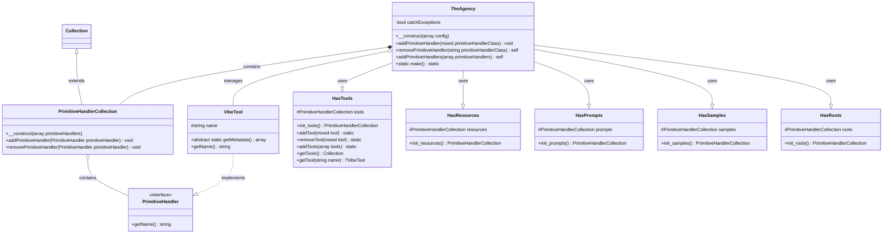

# Laravel Vibes Class Diagram

Below is a class diagram showing the relationship between TheAgency and its related classes in the Laravel Vibes package.

## Component Descriptions

### Core Classes

- **TheAgency**: Central manager for all MCP primitives in the Laravel Vibes package
- **PrimitiveHandlerCollection**: Collection class for storing and retrieving primitive handlers
- **VibeTool**: Base class for all tool primitive implementations

### Traits

- **HasTools**: Provides methods for managing tool primitives
- **HasResources**: Provides methods for managing resource primitives
- **HasPrompts**: Provides methods for managing prompt primitives
- **HasSamples**: Provides methods for managing sample primitives
- **HasRoots**: Provides methods for managing root primitives

### Interfaces

- **PrimitiveHandler**: Base interface for all MCP primitive handlers

## Relationships

- TheAgency uses multiple traits to incorporate primitive handling functionality
- Each trait manages a specific type of primitive handler through a PrimitiveHandlerCollection
- VibeTool implements the PrimitiveHandler interface to provide a consistent API
- PrimitiveHandlerCollection extends Laravel's Collection class for enhanced functionality 