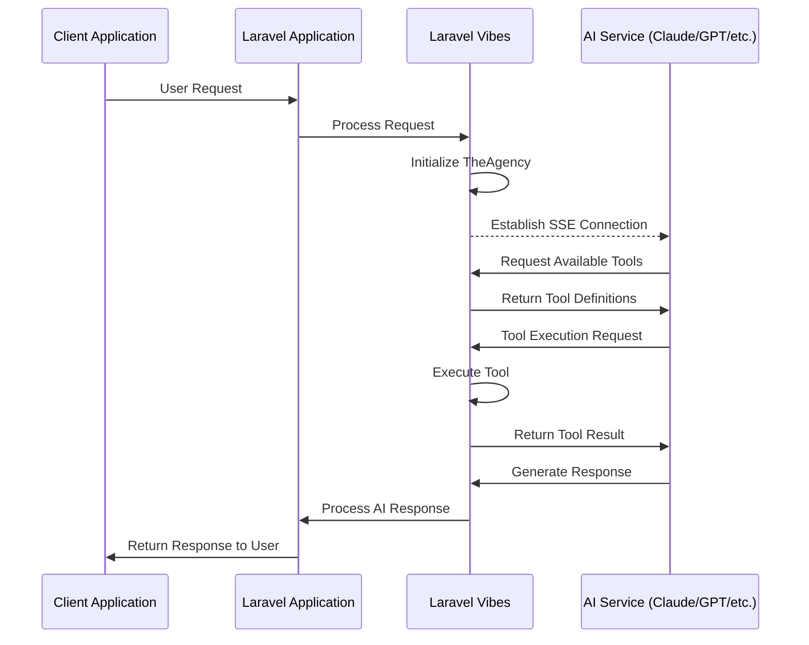
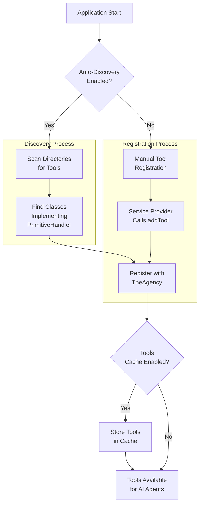
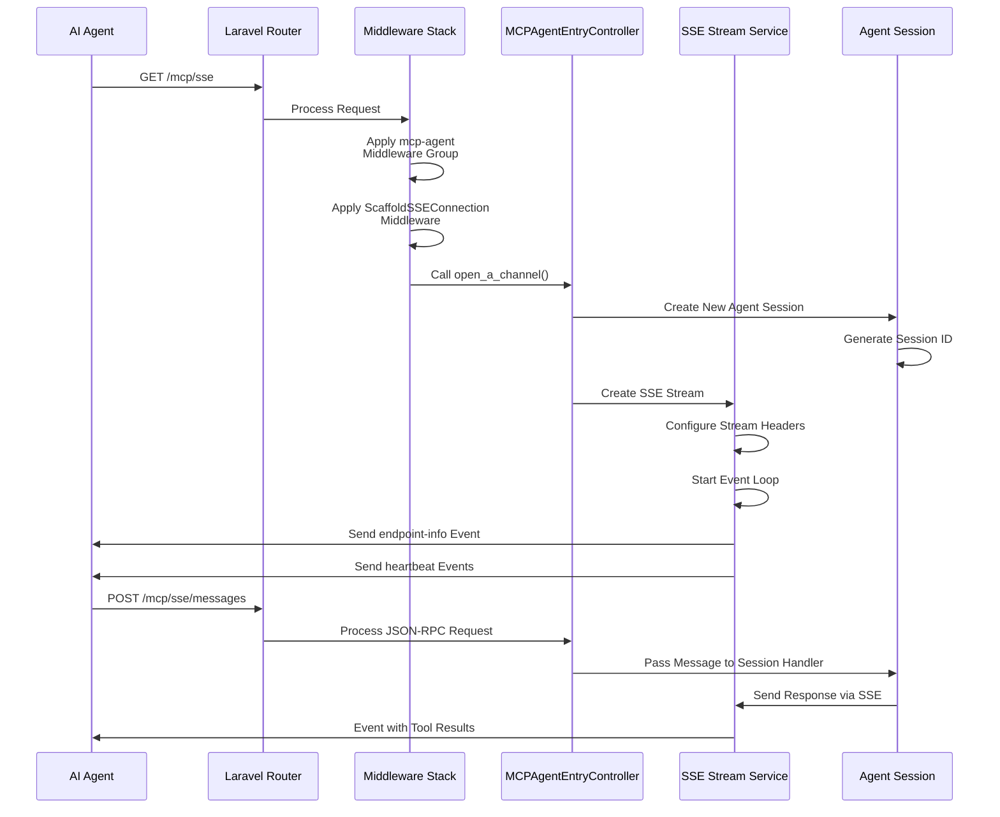
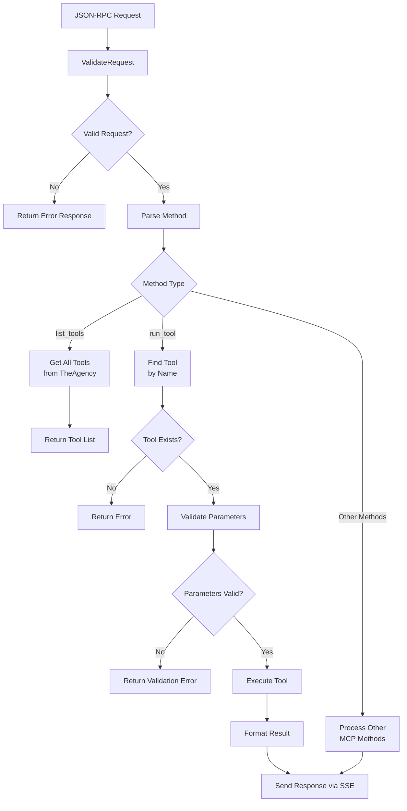
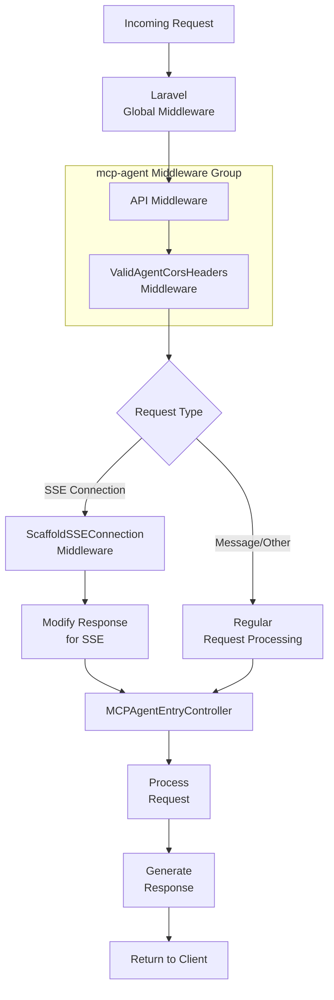
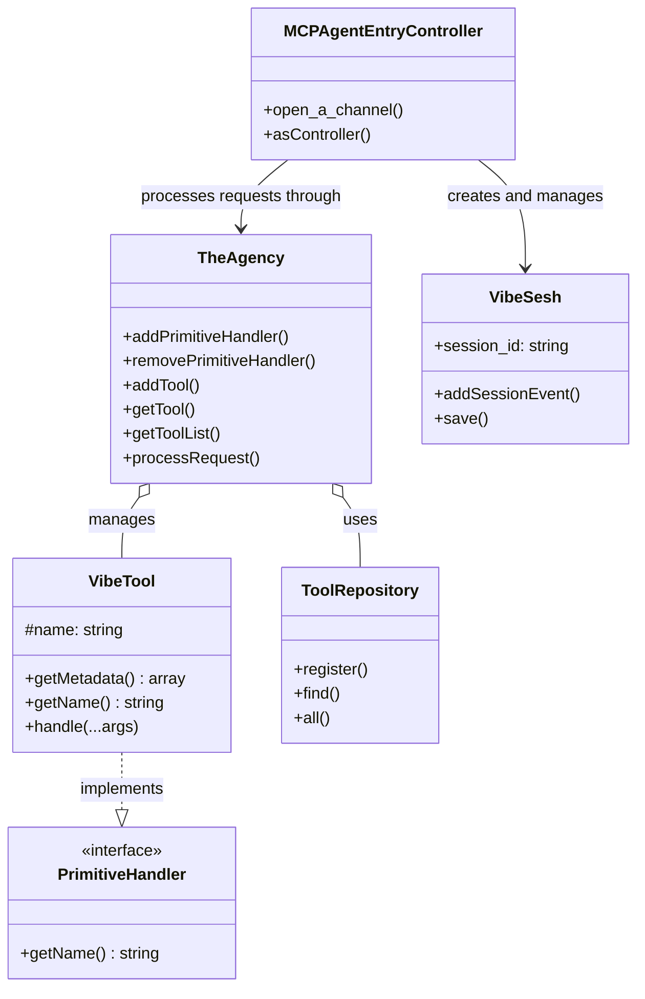

# Laravel Vibes Flow Diagrams

This document provides visual diagrams of the Laravel Vibes package architecture and interaction flows. These diagrams should help developers understand how the various components work together and how to implement the package in their applications.

## Table of Contents

- [Client-Laravel-AI Service Flow](#client-laravel-ai-service-flow)
- [Tool Registration and Discovery](#tool-registration-and-discovery)
- [Server-Sent Events (SSE) Connection Flow](#server-sent-events-sse-connection-flow)
- [MCP Message Processing Flow](#mcp-message-processing-flow)
- [Middleware Stack](#middleware-stack)
- [TheAgency Component Interactions](#theagency-component-interactions)

## Client-Laravel-AI Service Flow

This diagram illustrates the overall flow between a client application, Laravel application with Laravel Vibes, and an AI service using the MCP protocol.

## Tool Registration and Discovery

This diagram shows how tools are registered, discovered, and managed by Laravel Vibes.

## Server-Sent Events (SSE) Connection Flow

This diagram illustrates how Server-Sent Events (SSE) connections are established and maintained between Laravel Vibes and an AI agent.

## MCP Message Processing Flow

This diagram depicts how MCP protocol messages are processed by Laravel Vibes.

## Middleware Stack

This diagram shows the middleware stack used for Laravel Vibes endpoints and how requests flow through it.

## TheAgency Component Interactions

This diagram illustrates how TheAgency component interacts with other parts of Laravel Vibes.

These diagrams provide a visual representation of Laravel Vibes' architecture and interaction flows, helping developers understand how to implement and extend the package in their Laravel applications. 